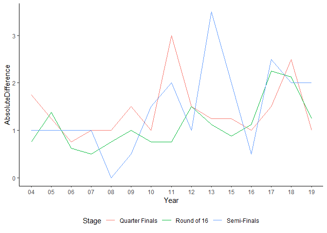

Champions League Competitive Changes
================

## Purpose

This script is part of a blog post which shows how to move from `dplyr`
over to `data.table`. It goes through creating new variables, creating
wide and long datasets, and grouping data.

``` r
KnockOutStage = AllChampionsLeagueDF %>% 
  as_tibble() 

FindLastThreeRounds = KnockOutStage %>% 
  count(Year, Round) %>% 
  tidyr::spread(Round , n) %>% 
  tidyr::gather(Round , Rows, -Year) %>% 
  filter(!is.na(Rows)) %>% 
  group_by(Year) %>%
  mutate(rown_n = n()) %>% 
  #mutate(row_n = n() - as.numeric(Round)) %>% 
  #filter(row_n  <=2) %>% 
  ungroup() %>% 
  group_by(Year) %>% 
  mutate(Stage = case_when(row_number() == 1 ~ "Round of 16",
                           row_number() == 2 ~ "Quarter Finals",
                           TRUE ~ "Semi-Finals"))
```

``` r
KnockOutStageDT = data.table(KnockOutStage)

FindLastThreeRoundDT =  KnockOutStageDT[,  .N, by = c("Year", "Round")] %>% 
  dcast(., Year ~ Round  , value.var = c("N")) %>% 
  melt(.,  measure = patterns("[[:digit:]]"), value.name =  c("Rows")) %>% 
  na.omit(., cols = c("Rows"))  

FindLastThreeRoundDT[, nth := row.names(.SD), by = "Year"]
LastRowYearDT =FindLastThreeRoundDT[, last(nth), by = Year]


setkey(FindLastThreeRoundDT,Year)
setkey(LastRowYearDT, Year)

FindLastThreeRoundDT_2 = FindLastThreeRoundDT[ LastRowYearDT, nomatch = 0]
FindLastThreeRoundDT_3 = FindLastThreeRoundDT_2[, row_n :=   as.numeric(V1) - as.numeric(variable) ][
  row_n <= 2][
    , row_names_2 := row.names(.SD), by = "Year"
  ][
    , Stage := fifelse(row_names_2  == 1, "Round of 16", 
                       fifelse(row_names_2 == 2 , "Quarter Finals", "Semi-Finals"))
  ][
    , Round := as.numeric(variable)
  ]

setkeyv(FindLastThreeRoundDT_3,c("Year", "Round"))
setkeyv(KnockOutStageDT, c("Year", "Round"))

KnockOutStageDT_2 = KnockOutStageDT[ FindLastThreeRoundDT_3, nomatch = 0]
setnames(KnockOutStageDT_2, "1st leg", "Leg1")

KnockOutStageDT_2[, HomeScore := stringr::str_sub(Leg1, 1, 1)][
  , AwayScore := stringr::str_sub(Leg1, 3, 3)
]

names_factors <- c("HomeScore", "AwayScore")
for(col in names_factors)
  set(KnockOutStageDT_2, j = col, value = as.numeric(KnockOutStageDT_2[[col]]))

KnockOutStageDT_2[, AbsoluteDifferece := abs(HomeScore - AwayScore)]

KnockOutStageDT_3 = KnockOutStageDT_2[, .(AbsoluteDifference = mean(AbsoluteDifferece)), by = Year][
  , Year := stringr::str_sub(Year, -2)
]

OverallGrowth = ggplot(KnockOutStageDT_3, aes(x = Year, y = AbsoluteDifference, group = 1)) +
  geom_line() +
  theme_classic()

KnockOutStageDT_Stg3 = KnockOutStageDT_2[, .(AbsoluteDifference = mean(AbsoluteDifferece)), 
                                         by = c("Year", "Stage" )][
  , Year := stringr::str_sub(Year, -2)
]

ByStageOverallGrowth = ggplot(KnockOutStageDT_Stg3, aes(x = Year, y = AbsoluteDifference, 
                                                        group = Stage, 
                                                        colour = Stage)) +
  geom_line() +
  theme_classic() +
  theme(legend.position = "bottom")
```

<!-- -->

<!-- -->
